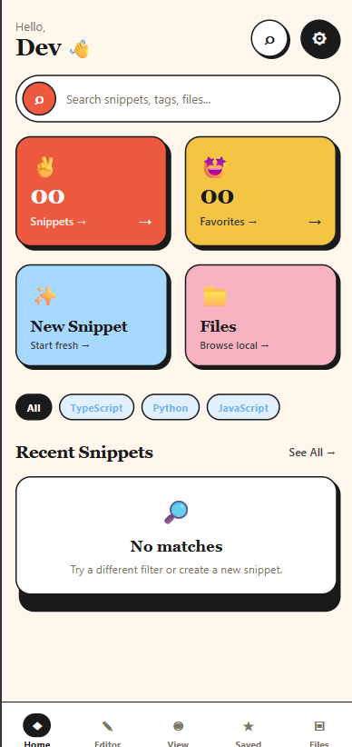
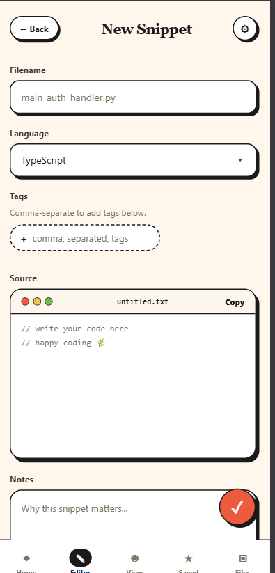
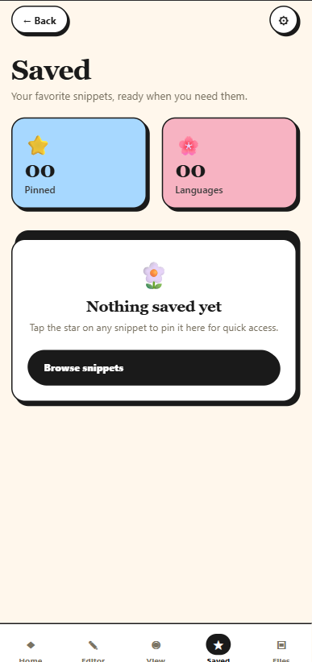

# Code Snippet App

A React Native Notes App built with Expo. This the app where developer can store the code snippets and easily manage and access their stored data.

## Screenshot

<p>
  
  
  
</p>

## Live Demo

live link: https://youtube.com/shorts/xxoUJwJVb5I?feature=share

## Features

- Code snippet storage
- Editor to edit code snippets
- View section
- file managemnt section

## Tech Stack

- React Native
- Expo
- Expo Router
- TypeScript

## Getting Started

Install dependencies:

```bash
npm install
```

Start the development server:

```bash
npx expor start
```

You can also run the app on a specific platform:

```bash
npm run android
npm run ios
npm run web
```

## Project Structure

```text
src/app/index.tsx    Main sign-in page screen
assets/              Images and app assets
```

## Linting

Run the linter:

```bash
npm run lint
```
